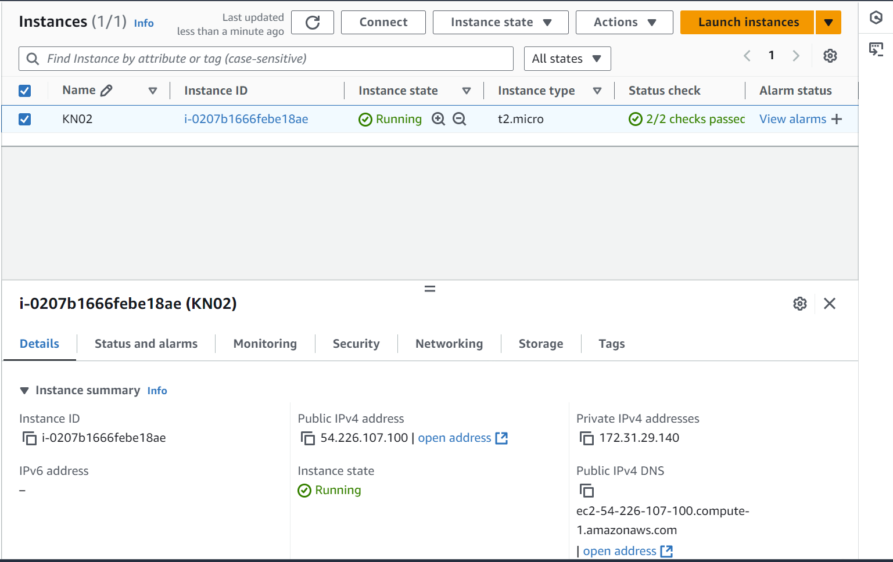

# KN02

## B) Instanz erstellen (40%)

### Instanzansicht



### Spezifikationen

| Diskgrösse     | 8GB    |
| Betriebssystem | Ubuntu |
| RAM            | 1GB    |
| Anzahl CPUs    | 1      |

## C) Zugriff mit SSH-Key (40%)

Um ssh mit einem spezifischen Key zu verwenden, brauch es zusätzlich den Parameter ```-i```

### Vorlage

``` bash
ssh -i <filename>
```

### Verbindungsversuch mit ssh

#### Key 1

``` bash
ssh -i "C:\Users\marzonev\.ssh\Nevio1.pem" ubuntu@107.23.82.141
```


#### Key 2

``` bash
ssh -i "C:\Users\marzonev\.ssh\Nevio2.pem" ubuntu@107.23.82.141
```


