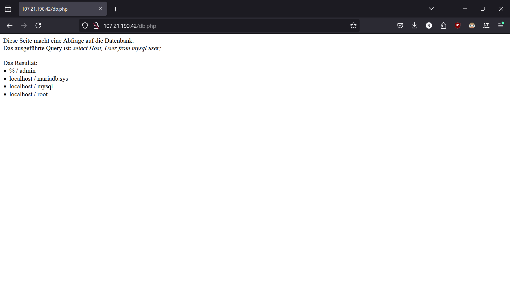
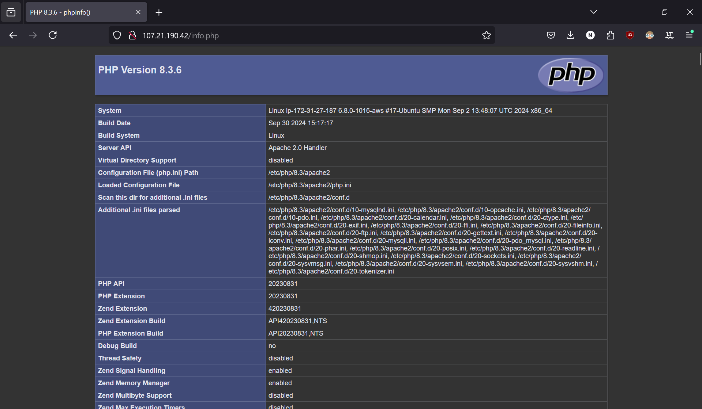
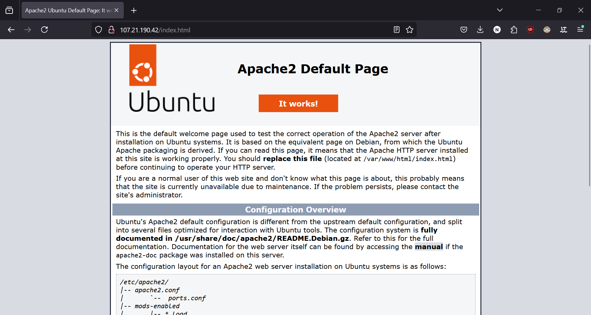
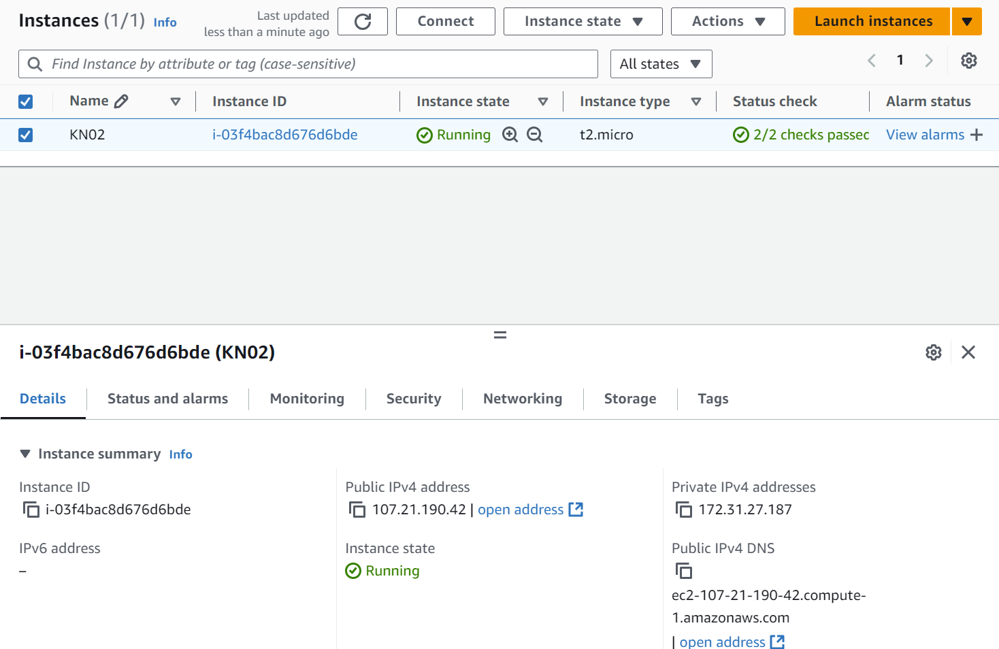
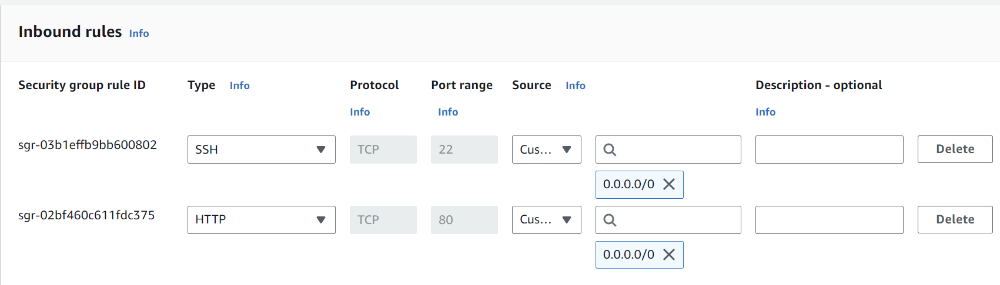
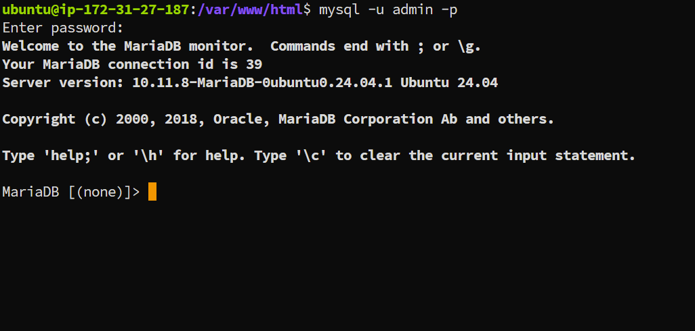
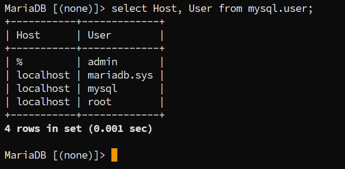

# KN03

## Abgabe

### Funktionierende Webseite





### Instanzansicht



### Sicherheitsgruppe



### Mysql login

``` mysql
mysql -u admin -p
```



### Mysql Abfrage

``` mysql
select Host, User from mysql.user;
```



#### Erklärung

Zeigt in der Tabelle mysql.user die Spalten Host und User an.
