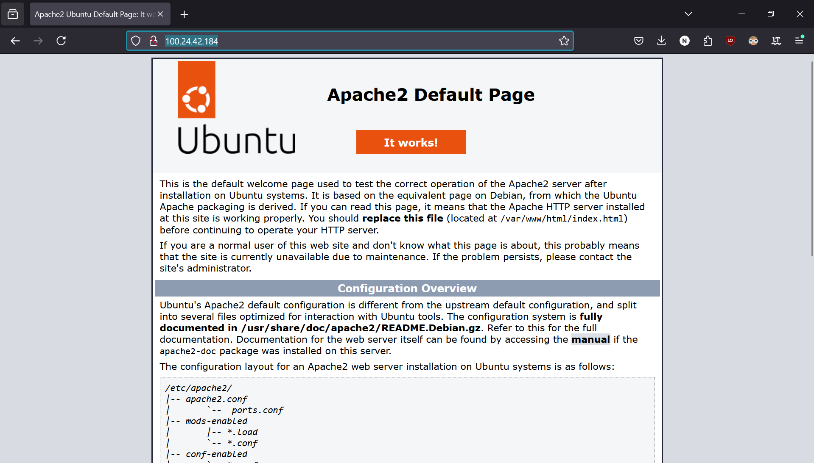

# KN 04

## B) SSH-Key und Cloud-init (15%)

[Hier](cloud-init.yaml) ist die Cloud-init Datei.

## C) Template (5%)

[Hier](Template.yaml) ist das Template.

## D) Installation automatisieren (70%)

### Datenbank

[Hier](cloud-init-db.yaml) ist die Cloud-init Datei

### Webserver

[Hier](cloud-init-web.yaml) ist die Cloud-init

