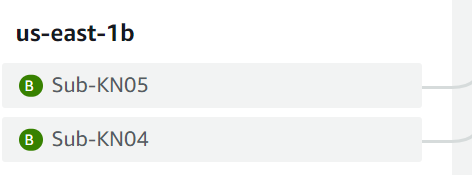
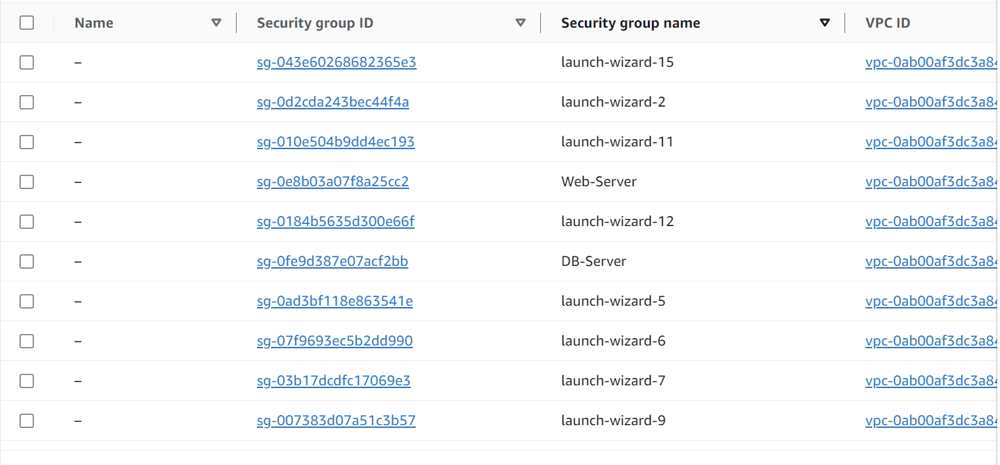
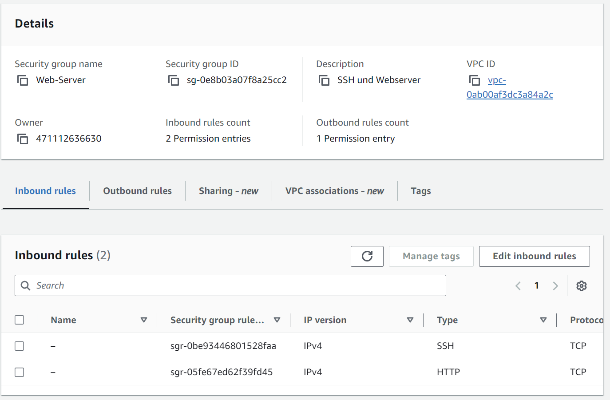
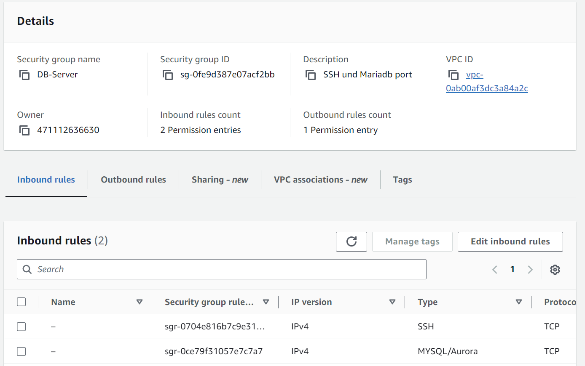
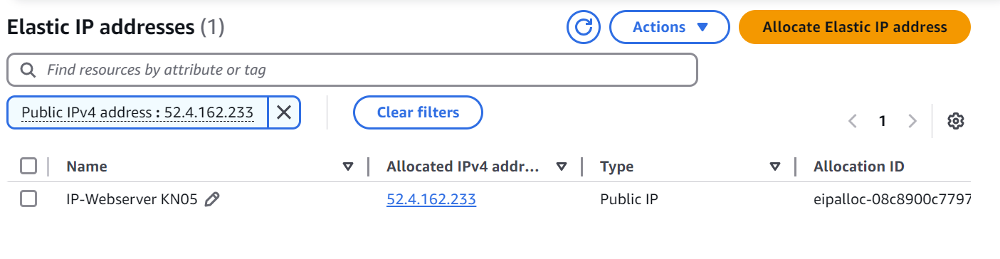
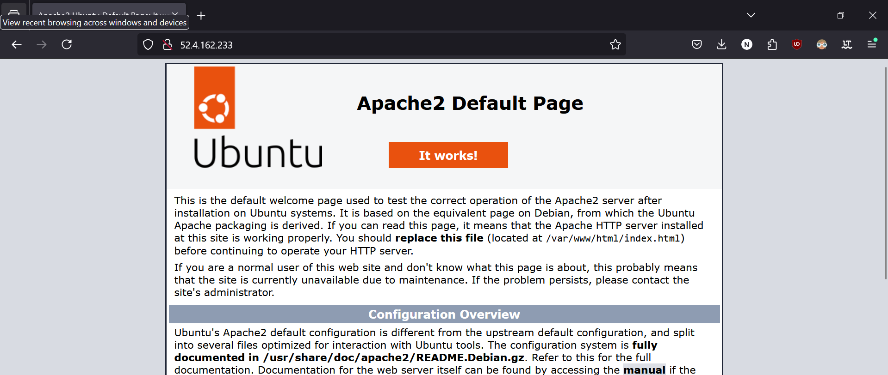
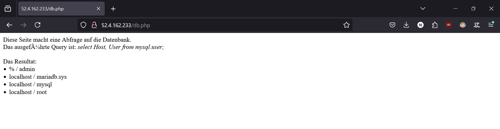
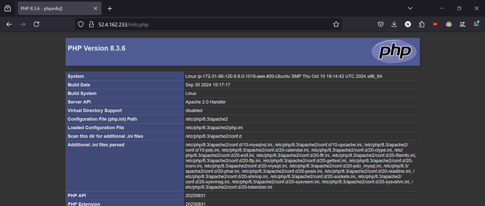

# KN 05

## Erklärung

### VPC

VPC ist ein virtuelles Netzwerk. Dort kann man Sachen wie Subnetze, public IPs, private IPs und static IPs definieren.

### Unterschied Public IP und Private IP

Die Public IP ist die welche von anderen Netzwerken aus erreicht werden kann. Die Private IP ist hinter dem Gateway und kann nur vom internen Netzwerk aus erreicht werden.

### Static IP

Eine statische IP wird **nicht** per DHCP zugewissen uns ist permanent

## Subnetze und IPs

IP-DB: 172.31.96.110

IP-Web: 172.31.96.120

## Sicherheitsgruppen

## Öffentliche, statische IP

## Instanzen erstellen

## Webseiten

