# KN 06

## A) Installation App (50%)

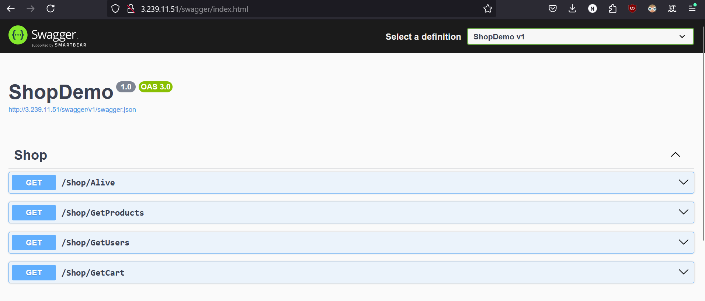

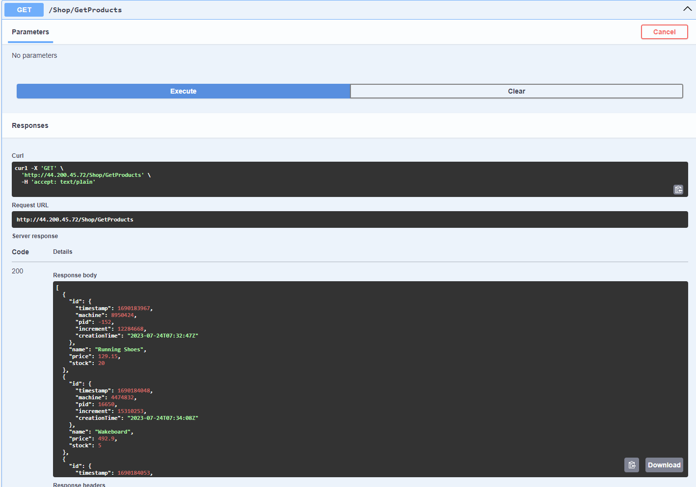

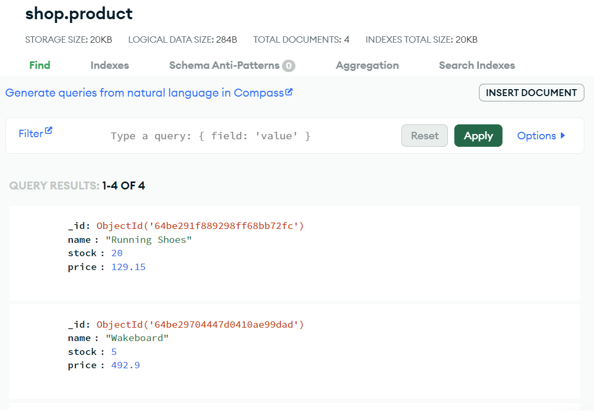

### Reverse Proxy

Ein Reverse Proxy liegt vor mehreren Servern. Er nimmt die Pakete an inspektiert diese und leitet diese dann an den richtigen Server.

### Cloud-Init Probleme

Man sollte die Benutzerdaten für das Login nicht im Klartext ins File einfügen.

## B) Vertikale Skalierung  (10%)

### Vorher

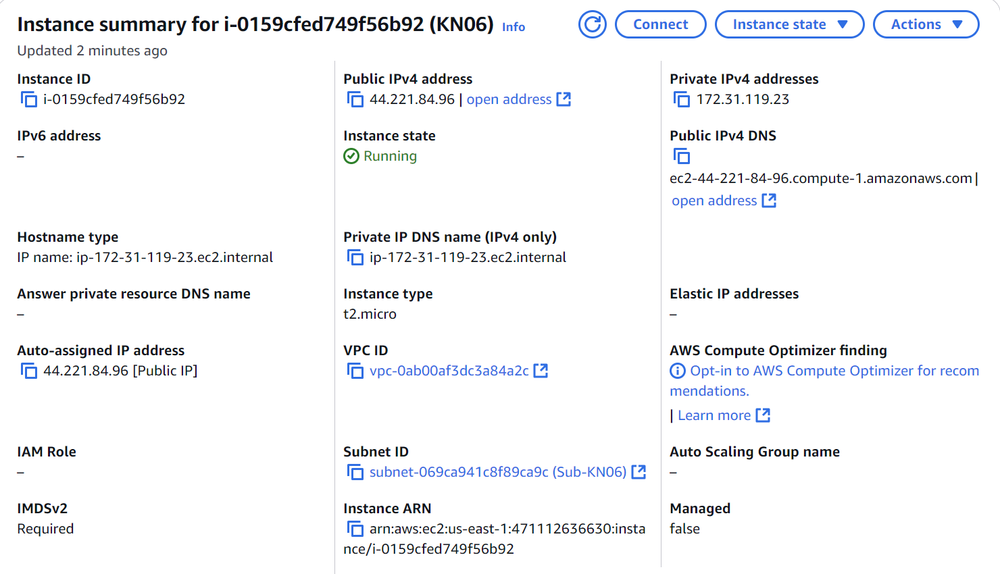

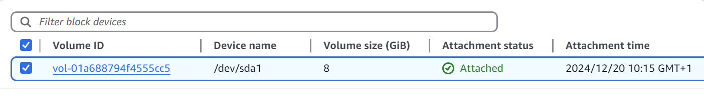

### Erklärung

In der Instanz unter Storage, findet man die aktuelle Disk.

Auf die Disk klicken.

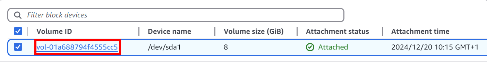

Dann oben rechts unter Actions > Modify Volume kann man die Disk Grösse erhöhen

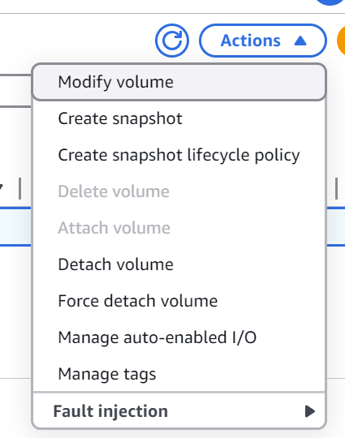

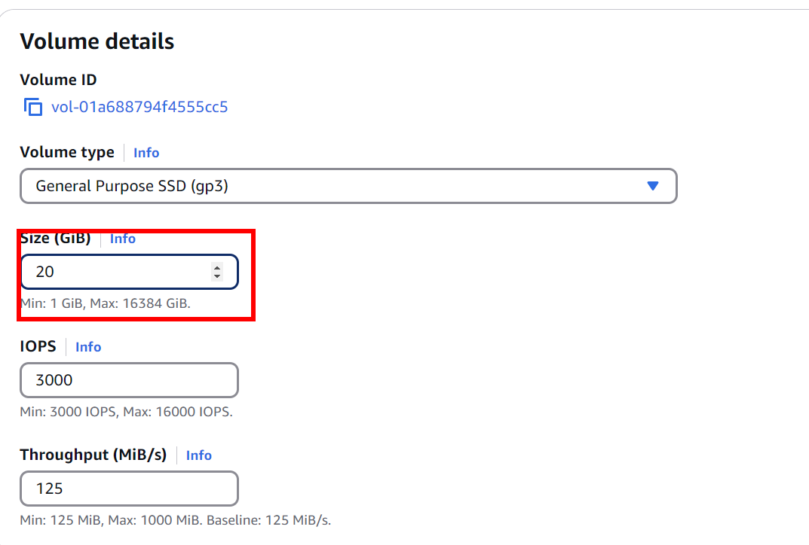

Um den Instanz Typ zu ändern muss man zuerst die Instanz stoppen.

Dann unter "Actions > Instance Settings > Change Instance Type" kann man den neuen Instanztyp auswählen.

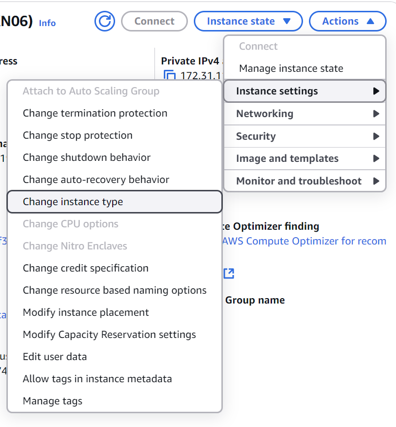

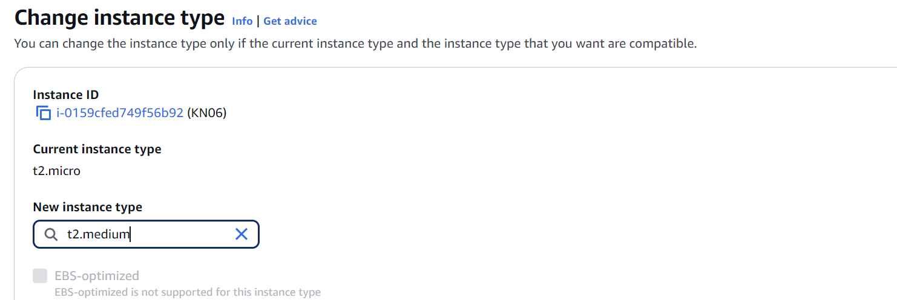

### Nacher

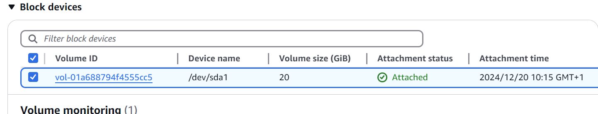

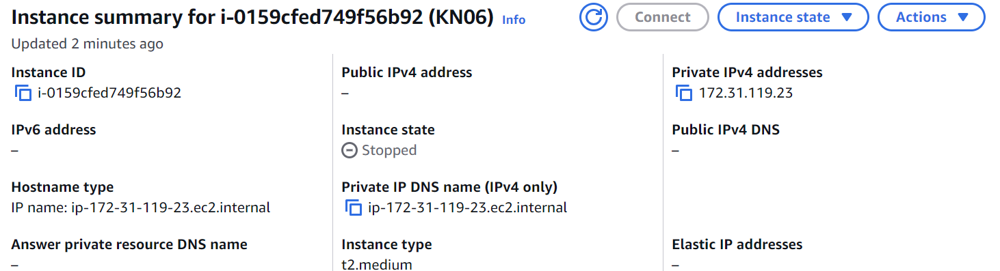

## C) Horizontale Skalierung (20%)

