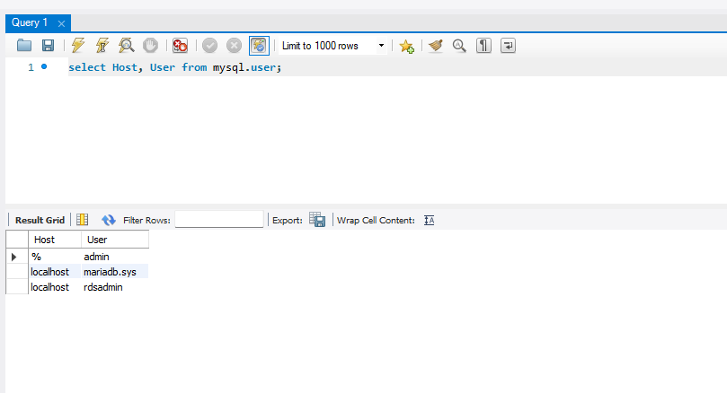

# KN07

## A) Datenbank im PAAS Modell (20%)

Die Wartung, Sicherstellung der Verfügbarkeit, und das Skalieren der Datenbank wird von den Anbietern übernommen.

Kosten für Mitarbeiter die sich um die Server kümmern ist wahrscheinlich höher als die Kosten für eine PAAS oder SAAS Datenbank.

## B) PAAS Applikation erstellen (60%)
