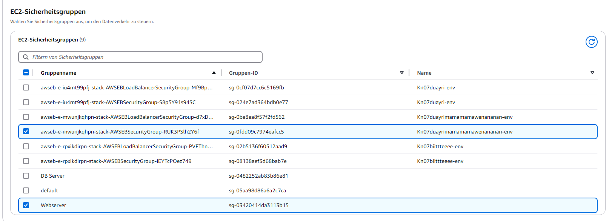
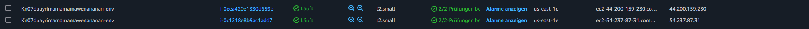

# KN07

## A) Datenbank im PAAS Modell (20%)

Die Wartung, Sicherstellung der Verfügbarkeit, und das Skalieren der Datenbank wird von den Anbietern übernommen.

Kosten für Mitarbeiter die sich um die Server kümmern ist wahrscheinlich höher als die Kosten für eine PAAS oder SAAS Datenbank.

## B) PAAS Applikation erstellen (60%)

Bei den Subnets habe ich zwei genommen, da ein Load Balancer verlangt, dass man mindestens zwei Subnets verwendet.

Ich habe auch eine Public IP hinzugefügt, falls ich direkt etwas auf der Instanz Troubleshooten will.

Als Securitygroup habe ich einfach eine ausgewählt, die HTTP (Port 80) durchlässt.

Auto Scalling habe ich einfach 2 minimum und 4 maximum, da dies genügt für einen Webserver.

## B) Erstellte Ressourcen/Objekte und CloudFormation (20%)

Es hat eine zusätzliche Security Group erstellt mit den selben Berechtigungen wie die welche ich ausgewählt habe.

Die zwei minimum Instances wurden auch erstellt.

Load-Balancer und Target Group wurden auch erstellt.

