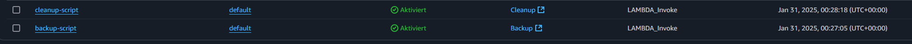

# KN08

## A) Backup-Skript (70%)

Die Tags der Instance

Hier ist die Liste der Snapshots

Hier ist der Tag des Snapshots

Hier sind die Snapshots nach dem Cleanup.

## B) Cron Job

Hier sind die zwei cron jobs