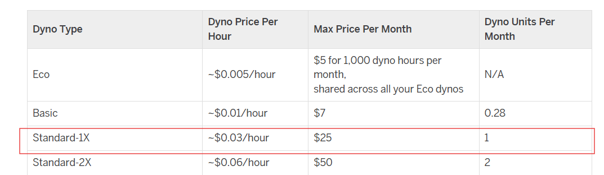
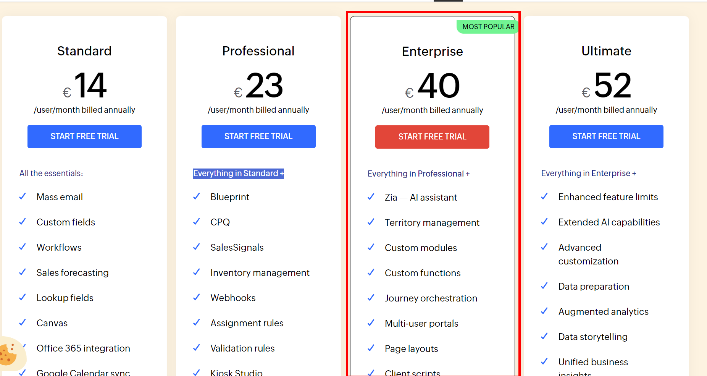
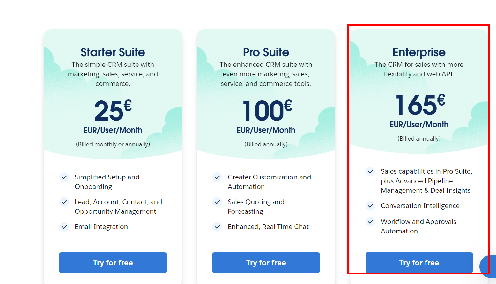

# KN 10 Kostenberechnung

## Spezifikationen

- 1 Web Server mit 1 Core, 20GB Speicher, 2 GB RAM, Ubuntu
- 1 DB Server mit 2 Cores, 100GB Speicher, 4 GB RAM, Ubuntu
- Backup-Speicher für die Datenbank Daten. Backups werden erstellt
  - täglich für die letzten 7 Tage
  - Wöchentlich für den letzten Monat
  - Monatlich für die letzten drei Monate.
- Anzahl Benutzer der Software: 30

## A) Kostenrechnung IAAS - Rehosting (60%)

### AWS

[Hier](media/Kostenberechnung-AWS.pdf) ist die Datei der Kostenberechnung

#### Gesamtpreis AWS

75.26CHF/Monat

### Azure

[Hier](<media/ExportedEstimate (5).xlsx>) ist die Datei der Kostenberechnung

#### Gesamtpreis Azure

85.45CHF/Monat

## B) Kostenrechnung PAAS - Replattforming (20%)

### Web-Server

### DB-Server

### Gesamtpreis Heroku

277CHF/Monat

## C) Kostenrechnung SAAS - Repurchasing (10%)

### Zoho CRM

Beim Zoho CRM nehmen wir die Enterprise Version

#### Gesamtpreis Zoho

40CHF/Monat

### Salesforce CRM

Beim Salesforce CRM nehmen wir die Enterprise suite.

#### Gesamtpreis Salesforce

165CHF/Monat

D) Interpretation der Resultate (10%)

### Kosten

| Cloudanbieter | Preis          |
| :------------ | :------------- |
| AWS           | 75.26CHF/Monat |
| Azure         | 85.45CHF/Monat |
| Heroku        | 277CHF/Monat   |
| Zoho          | 40CHF/Monat    |
| Salesforce    | 165CHF/Monat   |

Zoho-CRM ist am billigsten

### Aufwand

Bei den IAAS Lösungen kann man die bereits existierenden Server(Datenbank/Webserver) direkt auf die Cloud migrieren. **Schnellste Migration**

Bei den PAAS Service kann es möglich sein, das die Server(Datenbank/Webserver) angepasst werden müssen, damit sie auf dem vorgegeben Betriebssystem bzw. auf der vorgegeben Platform funktionieren.

Bei den SAAS Lösungen müssen alle Daten von der alten Datenbank zur neuen migriert werden. Da es ein neues Tool ist müssen die Mitarbeiter auch noch geschult werden um die Umgebung kennezulernen. **Am meisten Aufwand**

#### Lösung

Entweder Aws oder Zoho.